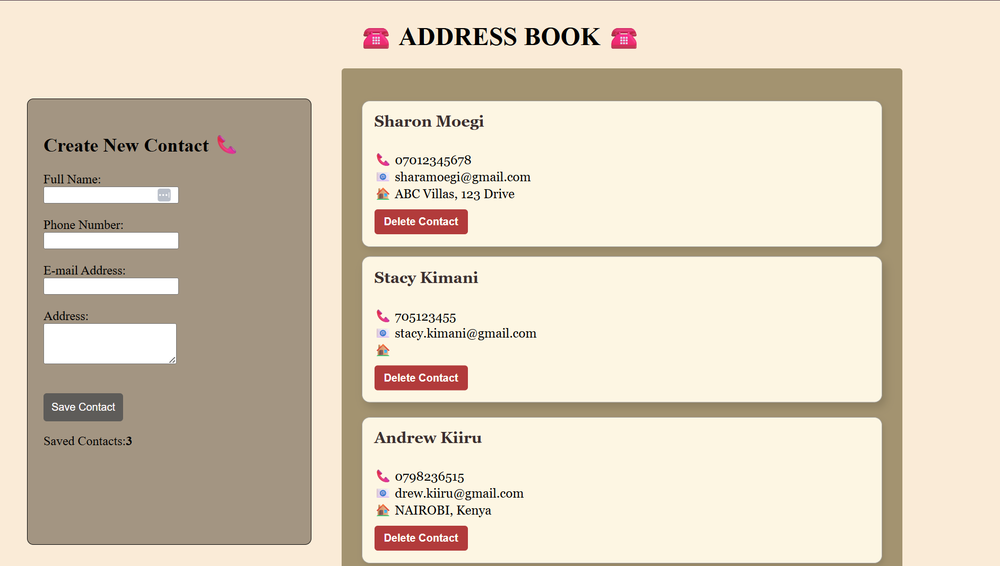

# Address-Book
A simple web-based Address Book.
It allows the user to Create, View aand Delete contacts, in a clean card-style interface.
---
### Web-page Preview


---
## Author's Information
#### Author's Name : Sharon Moegi
#### Contact Info: (Email) sharamoegi@gmail.com

## Setup Instructions:
- Clone the repository:
 (```bash
    git clone https://github.com/shara-arch/Address-Book.git )
- Open terminal command line then navigate to the root folder of the application. `cd Address-Book`
- Open `index.html` on your preferred browser.


## Behaviour Driven Development
### 1. Displays Form for Contact Details
   - INPUT: "Contact's Name"
   - INPUT: "Contact's Phone Number"
   - INPUT: "Contact's E-mail Address"
   - INPUT: "Contact's Physical Address"
   - OUTPUT: "Displays saved Contacts with relevant details"

### 2. Displays an Error message if :
   - Full Name is null
   - Phone number is null
   - E-mail address is null

### 3. Clears Form and Adds Contact
   - INPUT : "Save Contact"
   - OUTPUT: "Clear Form"
   - OUTPUT: "Render Contact List"

## Technologies Used
- HTML
- CSS
- JavaScript

## Link to Live Cite
https://shara-arch.github.io/Address-Book/
